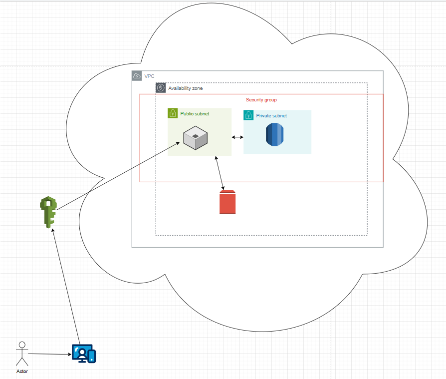

# DIO-desenho-ec2
Desenhando arquiteturas com EC2, Lambda

## 🏗️ Arquitetura do Sistema: Visão Geral

Esta seção descreve os principais componentes da arquitetura AWS e o fluxo de interação do usuário, desde a autenticação até as transações de compra e armazenamento de arquivos.

### 1\. Diagrama (Placeholder)

### 2\. Componentes Principais da AWS

| Componente | Função na Arquitetura | Nível de Ação |
| :--- | :--- | :--- |
| **Amazon EC2** | Hospeda a aplicação principal do sistema e processa todas as requisições dos usuários. | Compute |
| **Amazon Cognito / IAM** | Gerencia a identidade e o acesso. O Cognito lida com o *pool* de usuários, e o IAM fornece as credenciais e autorização para acessar outros serviços AWS. | Segurança e Identidade |
| **Amazon RDS** | Serviço de banco de dados relacional. Armazena dados transacionais do sistema (ex: informações de compra, catálogos). | Banco de Dados |
| **Amazon EBS** | Volume de armazenamento de bloco persistente anexado à instância EC2. Usado para armazenar arquivos enviados pelos usuários. | Armazenamento |

### 3\. Fluxo de Interação do Usuário

O fluxo a seguir descreve a jornada do usuário dentro do sistema:

#### A. Autenticação de Acesso

1.  **Acesso Inicial:** O usuário acessa o sistema através da aplicação hospedada na instância **EC2**.
2.  **Login:** Ao tentar fazer login, o sistema direciona a requisição de autenticação para o **Amazon Cognito**.
3.  **Autorização:** O **IAM** atua em conjunto, verificando as políticas de acesso e autorizando o usuário a continuar, retornando as credenciais de sessão para o sistema.

#### B. Armazenamento de Arquivos

1.  **Upload:** O usuário envia um arquivo para ser salvo na aplicação hospedada no EC2.
2.  **Persistência:** O sistema no EC2 salva o arquivo diretamente no volume de **Amazon EBS** que está anexado à instância.

#### C. Fluxo de Compra e Transação

1.  **Inicia Transação:** O usuário realiza uma compra no sistema.
2.  **Consulta:** O aplicativo no EC2 faz uma consulta ao banco de dados **Amazon RDS** para verificar estoque ou dados relacionados à compra.
3.  **Processamento:** O EC2 processa a transação e envia a requisição de gravação.
4.  **Atualização:** Os dados da compra são salvos e o estado do banco de dados no **RDS** é atualizado (ex: registro de transação e diminuição de estoque).

